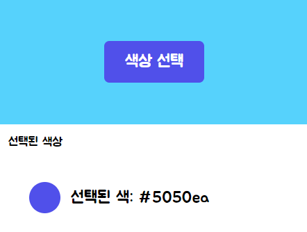

<!-- 
아래 내용으로 이쁘게 꾸며줘. 내용도 수정해줘.

기능 : 색상값을 빠르게 가져오기 위해서 개발했음

사진 : ./image.png

크롬 확장프로그램 개발, 사용도구는 바닐라js

사용된 api 및 폰트
https://developer.mozilla.org/en-US/docs/Web/API/EyeDropper
https://fonts.google.com/?subset=korean&noto.script=Kore
 -->

# Color Picker

## 기능
색상값을 빠르게 가져온다.

## 사진

## 개발
### 한글로 Vanlilla JS를 개발하면 어떨까? 하는 생각으로 개발했습니다.

## 후기
한국어의 한 마디, 음절이 생각보다 가독성이 떨어진다.  
`선택된색상텍스트` / `selectedColorText` 보면 알겠지만 코딩 명명 규칙이 한글엔 적용을 안해서 읽기 쉽지 않다.  
다음에 한다면 `선택된-색상-텍스트`처럼 구분하면 좋을 것 같다. 아 확실히 변수명짓기 편해서 좋긴했음 ㅋㅋ;

## 참고

- [EyeDropper](https://developer.mozilla.org/en-US/docs/Web/API/EyeDropper)
- [Google Fonts](https://fonts.google.com/?subset=korean&noto.script=Kore)
