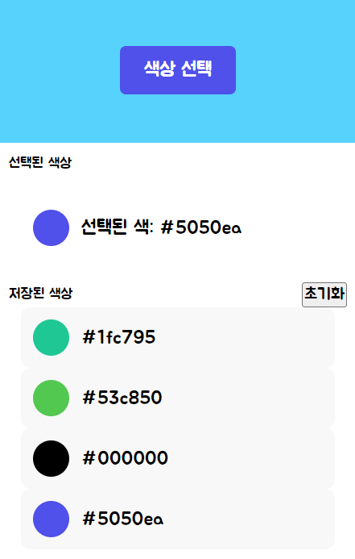

# Color Picker

## 기능

색상값을 빠르게 가져오는 툴

## 사진

<table class="image-table">
  <tr>
    <td>
      
      
Version 1.0.2

    </td>
    <td>
      
      
Version 1.1.0

    </td>
  </tr>
</table>

### 한글로 Vanlilla JS를 개발하면 어떨까?
## (version 1.0.2) : 파일명을 한글로하면 chrome extension 인식 안되는 오류가 있었다.

## 후기

한국어의 한 마디, 음절이 생각보다 가독성이 떨어진다.  
`선택된색상텍스트` / `selectedColorText` 보면 알겠지만 코딩 명명 규칙이 한글엔 적용을 안해서 읽기 쉽지 않다.  
다음에 한다면 `선택된-색상-텍스트`처럼 구분하면 좋을 것 같다. 아 확실히 변수명짓기 편해서 좋긴했음 ㅋㅋ;

## 패치

### version 1.0.2 : 단일 색상 값을 가져올 수 있습니다.
### version 1.1.0 : 저장된 색상 기능을 추가했습니다. (localStorage)

## 참고

- [EyeDropper](https://developer.mozilla.org/en-US/docs/Web/API/EyeDropper)
- [Google Fonts](https://fonts.google.com/?subset=korean&noto.script=Kore)
